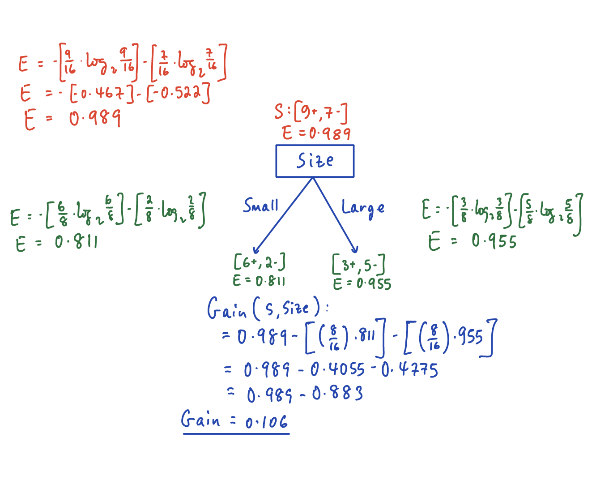

## PART A:
## QA1: What is the key idea behind bagging? Can bagging deal both with high variance (overfitting) and high bias (underfitting)?  

Bagging, also referred to as bootstrap aggregation, is an ensemble learning method. It leverages a bootstrap sampling technique to create different classifiers based on random samples of training datasets. These training instances are sampled with replacement where the same instance can be selected more than once. These bootstraps are then trained independently and in parallel with each other using base learners. It is finally used to make predictions either for regression or classification. For the later, majority votes are used to select the prediction, while averages are used for the former. \  
Bagging can be used to deal with/reduce high variance (overfitting), but not high bias (underfitting). The reason being, even if individual classifiers are overfitted, they tend to be overfitted in different ways and as a result the final ensemble reduces overfitting. However, if the individual classifiers are underfitted due to the same bias, the ensemble will also be underfitted. \ 

## QA2: Why bagging models are computationally more efficient when compared to boosting models with the same number of weak learners? 

In terms of computational efficiency, bagging methods can have an advantage over boosting models due to the fact that the independent models being trained can be done simultaneously through parallelization. This can not be done in boosting models as the classifiers being trained are done iteratively (i.e. each step learning from its predecessor) and hence can't be done simultaneously. \  
Additionally, since boosting models are layered, troubleshooting will be much more complex.

## QA3: James is thinking of creating an ensemble mode to predict whether a given stock will go up or down in the next week.  He has trained several decision tree models but each model is not performing any better than a random model. The models are also very similar to each other. Do you think creating an ensemble model by combining these tree models can boost the performance? 

The whole point of ensemble models is diversity and if the models in this case are very similar, it defeats the whole purpose. As the probability of varied models making the same error is much smaller than when using very similar models. Additionally, it would not help improve overfitting. For ensemble models to be able to work as planned, the base learners should be better than a random model and be independent from each other. Neither is the case in the above example and hence the above example would not boost performance. 

## QA4: Consider the following Table that classifies some objects into two classes of edible (+) and non- edible (-), based on some characteristics such as the object color, size and shape. What would be the Information gain for splitting the dataset based on the “Size” attribute? 

Information Gain is **0.106** \  
<center>

</center>

## QA5: Why is it important that the m parameter (number of attributes available at each split) to be optimally set in random forest models? Discuss the implications of setting this parameter too small or too large. 

The basic idea behind selecting m sample features from among a total of p features is to create a level of differentiation on the Random Forest model. Thereby, this differentiation provides a greater ensemble to aggregate over, producing a more accurate predictor. 
The reason behind selecting an optimal m parameter is, if it's set too large, we would lose diversity in the individual trees. If it's set too low, the individual trees will not be predictive. As a result, there should be a delicate balance for optimal m. The creators of this model suggest, in the case of classification m be set sqrt(p) and be set to p/3 for regression. However, the optimal value for m depends on the nature of the problem and should be treated as a tuning parameter. 

## PART B: Building decision tree and random forest models to answer a number of questions. We will use the Carseats dataset that is part of the ISLR package.

## QB1: Build a decision tree regression model to predict Sales based on all other attributes ("Price", "Advertising", "Population", "Age", "Income" and "Education").  Which attribute is used at the top of the tree (the root node) for splitting? 

**Price** attribute is used at the root node for splitting. The decision tree is indicated below: 
```{r warning=FALSE, error=FALSE, message=FALSE} 
library(ISLR)
library(dplyr)
library(glmnet)
library(caret)
library(rpart)
library(rattle)

Carseats_Filtered <- Carseats %>% select("Sales", "Price", "Advertising","Population",
                                         "Age","Income","Education")
csModel <- rpart(Sales~., data = Carseats_Filtered, method = 'anova')
#plot(csModel)
#text(csModel)
fancyRpartPlot(csModel)
```

## QB2: Consider the following input: Sales=9, Price=6.54, Population=124, Advertising=0, Age=76, Income= 110, Education=10. What will be the estimated Sales for this record using the decision tree model? 

```{r warning=FALSE, error=FALSE, message=FALSE} 
testCarseats <- data.frame(Sales=9, Price=6.54, Advertising=0, 
                          Population=124, Age=76, Income= 110, Education=10)

predict(csModel, testCarseats, method="anova")
```
The estimated Sales for this specific record is **9.586**

## QB3: Use the caret function to train a random forest (method=’rf’) for the same dataset. Use the caret default settings. By default, caret will examine the “mtry” values of 2,4, and 6. Recall that mtry is the number of attributes available for splitting at each splitting node. Which mtry value gives the best performance? (Make sure to set the random number generator seed to 123)

```{r warning=FALSE, error=FALSE, message=FALSE} 
library(caret)
library(randomForest)

set.seed(123)
# Creating a model for partitioning the carseats data into two parts
Partition <- createDataPartition(Carseats_Filtered$Sales, p = 0.7, list = FALSE)
cs_train <- Carseats_Filtered[Partition,]
cs_test <- Carseats_Filtered[-Partition,]

rf.model <- train(Sales ~ ., data = cs_train, method = 'rf',
                  trControl = trainControl(method = "oob"))
print(rf.model)


```
We can observe that **mtry = 4** gives the best performance when choosing the default settings.

## QB4: Customize the search grid by checking the model’s performance for mtry values of 2, 3 and 5 using 3 repeats of 5-fold cross validation. 

```{r warning=FALSE, error=FALSE, message=FALSE} 
set.seed(123)
tunegrid <- expand.grid(.mtry=c(2,3,5))
rf.modelcv <- train(Sales ~ ., data = cs_train, method = 'rf', metric = 'RMSE', 
                    tuneGrid = tunegrid, trControl = trainControl(method = 'repeatedcv', 
                                                                  number = 5, repeats = 3, 
                                                                  search = 'grid'))
print(rf.modelcv)
```
We can observe from the model that **mtry value of 3** gives the optimal performance.
